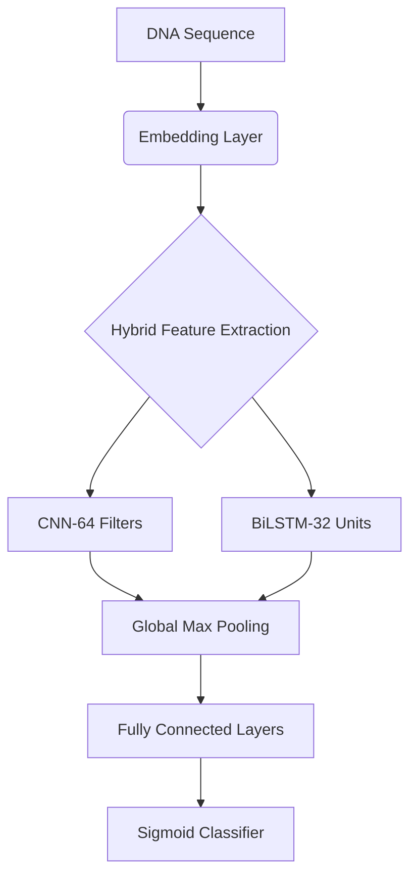

# DeepProp - DNA Promoter Prediction with Deep Learning

[](https://www.python.org/)

A CNN-BiLSTM hybrid deep learning model for predicting core DNA promoters, trained on biological datasets from Hugging Face.

## 📌 Core Features

- Automated DNA sequence preprocessing & encoding
- Hybrid neural architecture (CNN + BiLSTM)
- Class imbalance handling & early stopping
- Complete training/evaluation/prediction pipeline
- One-click pretrained model inference

## 📦 Installation

```bash
pip install datasets tensorflow scikit-learn numpy pandas joblib
```

## 🧬 Dataset

Using official Hugging Face dataset:
```python
dataset = load_dataset("dnagpt/dna_core_promoter")
```

Dataset characteristics:
- Sequence length range: 40-300bp
- Balanced positive/negative samples
- Contains eukaryotic core promoter sequences

## 🚀 Quick Start

### 1. Train the Model
```python
python DeepProp.py
```

### 2. Prediction Example
```python
test_seq = "TATAATGGCTAGCATCGACTAGCTAGCATCGACTAGCTAGCATCGACTAGCTAGC"
result = predict_promoter_dl(test_seq)
```

### 3. Sample Output
```json
{
    "is_promoter": 1,
    "probability": 0.9278,
    "confidence": 0.9278
}
```

## 🧠 Model Architecture



## 📊 Performance Metrics

| Metric       | Test Performance |
|--------------|------------------|
| Accuracy     | 83.55%           |
| F1 Score     | 83.33%           |
| Precision    | 83.44%           |
| Recall       | 84.79%           |

Confusion Matrix:
```
[[3767  673]
 [ 788 3652]]
```

## 📂 Project Structure

```
DeepProp/
├── DeepProp.py            # Main script
├── best_model.keras       # Pretrained model
├── dna_preprocessor.pkl   # Preprocessing pipeline
├── README.md
└── requirements.txt
```

## 🤝 Contributing

1. Fork the Project
2. Create your Feature Branch (`git checkout -b feature/AmazingFeature`)
3. Commit your Changes (`git commit -m 'Add some AmazingFeature'`)
4. Push to the Branch (`git push origin feature/AmazingFeature`)
5. Open a Pull Request

## 📜 License

Distributed under the MIT License. See `LICENSE` for details.

## 📧 Acknowledgments

- Hugging Face team for biological datasets
- TensorFlow development team
- All open-source contributors
```

This README includes:
1. Project badges and metadata
2. Clear installation/usage instructions
3. Interactive architecture diagram (requires Mermaid support)
4. Structured performance reporting
5. Complete development workflow guidance
6. Standardized open-source licensing

Recommended enhancements:
1. Add `requirements.txt`
2. Include LICENSE file
3. Create `examples/` directory for use cases
4. Configure CI/CD pipelines
